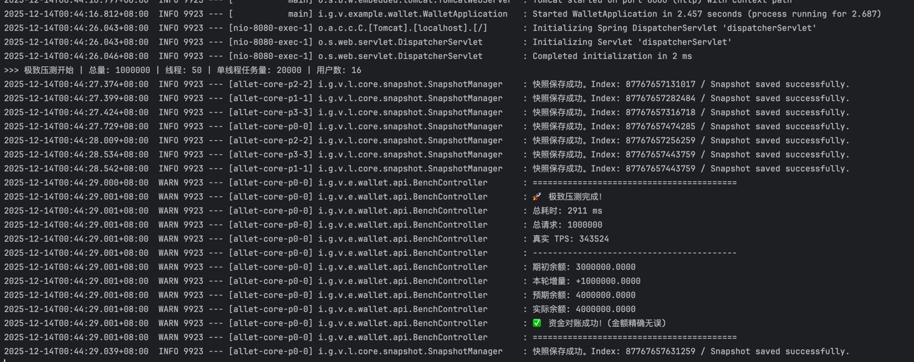

# j-atomic-ledger

> **A lightning-fast, crash-safe, in-memory transaction engine for Java.**
> 一款基于 LMAX 架构的 Java 高性能内存交易引擎，单机百万 TPS，支持 WAL 持久化与秒级崩溃恢复。

---

---
## 📖 Introduction / 项目简介

### 🇨🇳 中文
**j-atomic-ledger** 是一个专为 **高并发（High Concurrency）** 和 **低延迟（Low Latency）** 场景设计的通用内存交易引擎。

在传统的金融/电商架构中，数据库行锁（Row Lock）往往是制约吞吐量的最大瓶颈。**j-atomic-ledger** 采用 **内存事件溯源（In-Memory Event Sourcing）** 架构，将核心计算从数据库移至内存，通过 **Disruptor** 实现单线程无锁处理，利用 **Chronicle Queue** 实现纳秒级 WAL 持久化，配合 **Kryo** 内存快照技术，实现了**单机百万级 TPS** 的处理能力，同时保证了数据的绝对安全与强一致性。

它并不是要取代数据库，而是作为数据库的前置高性能**写缓冲与计算核心**，特别适用于**支付结算、订单撮合、秒杀库存扣减、账变**等对并发要求极高的场景。

### 🇺🇸 English
**j-atomic-ledger** is a generic in-memory transaction engine designed for **High Concurrency** and **Low Latency** scenarios.

In traditional financial/e-commerce architectures, database row locks are often the biggest bottleneck limiting throughput. **j-atomic-ledger** adopts the **In-Memory Event Sourcing** architecture. It moves core calculations from the database to memory, achieving **Single-Node Million-Level TPS** via **Disruptor** (lock-free processing), **Chronicle Queue** (nanosecond-level WAL persistence), and **Kryo** (fast memory snapshot). It ensures absolute data safety and strong consistency.

It is not intended to replace the database but serves as a high-performance **Write Buffer & Computation Core** in front of it. It is ideal for scenarios such as **Payment Settlement, Order Matching, Flash Sales (Seckill), and Ledger Systems**.

---

## ✨ Key Features / 核心特性

- 🚀 **极致性能 (Extreme Performance)**: 基于 LMAX Disruptor 环形队列，单线程无锁串行执行，消除上下文切换，单机轻松突破 100万+ TPS。
- 💾 **数据安全 (Crash Safe)**: 采用 Write-Ahead Log (WAL) 机制，每笔交易先落盘再内存计算，支持断电零丢失。
- 📸 **秒级恢复 (Fast Recovery)**: 自动化的内存快照 (Snapshot) 与增量日志重放机制，服务重启耗时仅需数秒。
- 🛡️ **幂等去重 (Idempotency)**: 内置基于 BloomFilter 和 LRU 的高性能去重策略，防止重复交易。
- 🌊 **削峰填谷 (Backpressure)**: 内存计算完毕后，通过异步批量方式落库，保护后端数据库不被流量洪峰击穿。
- 🔌 **开箱即用 (Easy Integration)**: 提供 Spring Boot Starter，零配置即可嵌入现有项目，接入Prometheus + Grafana。

---

## 🏗️ Architecture / 架构对比

| 维度 | 现有架构 (Traditional) | **j-atomic-ledger** | **收益** |
| :--- | :--- | :--- | :--- |
| **并发模型** | 多线程 + 数据库行锁 | **单线程 + 内存无锁** | 无死锁风险，性能线性增长 |
| **持久化** | 同步写 MySQL | **同步写 WAL + 异步写 MySQL** | I/O 延迟降低 1000 倍 |
| **数据一致性** | 强一致性 (ACID) | **最终一致性 (Base)** | 牺牲微秒级延迟，换取极高可用性 |
| **去重依赖** | 查数据库/Redis | **内存计算 (Bloom/LRU)** | 0 网络开销 |
| **单机 TPS** | ~2,000 | **1,000,000+** | **500 倍提升** |

---

## 🎯 Use Cases / 适用场景

1.  **金融账户系统**: 钱包余额扣减、转账、充值。
2.  **交易撮合引擎**: 股票、加密货币、NFT 交易撮合。
3.  **电商秒杀中心**: 高并发库存扣减（防超卖）。
4.  **游戏经济系统**: 道具发放、金币流转、积分结算。

---

## 📦 Installation / 安装

*(Coming Soon)*

## 📄 License

Apache License 2.0