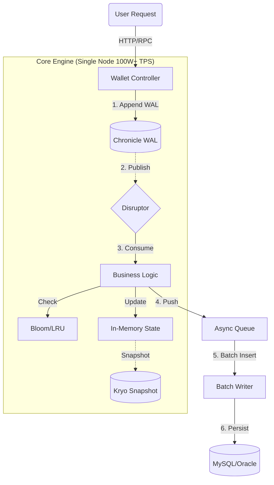
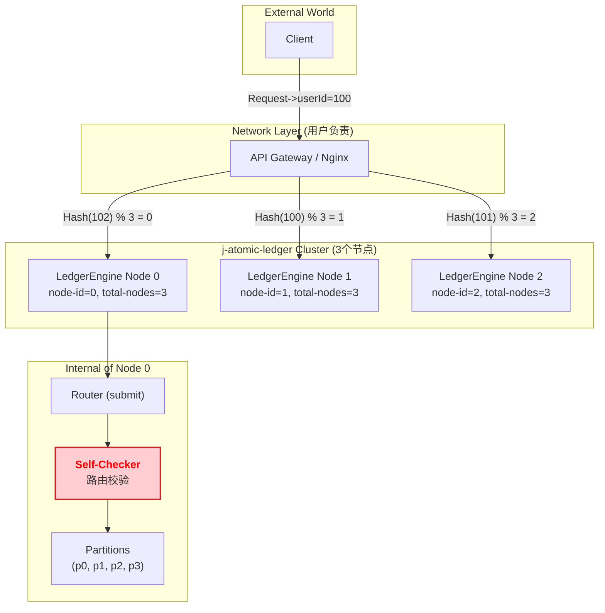

# j-atomic-ledger
#### 作者 Author：VEVOLY
> **基于 LMAX 架构的 Java 高性能内存交易引擎，单机百万 TPS，支持 WAL 持久化与秒级崩溃恢复，可集群部署。**  
> A Java high-performance memory transaction engine based on the LMAX architecture, single machine million TPS, supports WAL persistence and second-level crash recovery. support Cluster deployment.
---
[](LICENSE)
[]()
[]()
---

> 此次测试是在 Mac M1 芯片只有4核的环境下跑出，单核跑出10万TPS。若是16核服务器，轻松上百万TPS。  
> This test is run on a Mac M1 chip with only 4 cores, achieving 100,000 TPS. If it is a 16-core server, it can easily reach millions of TPS.
---

## 📖 1. Introduction / 项目简介

### 1.1 项目概述 🇨🇳
**j-atomic-ledger** 是专为 **高并发（High Concurrency）** 和 **低延迟（Low Latency）** 场景设计的通用内存交易引擎。
在传统的金融/电商架构中，数据库行锁（Row Lock）往往是制约吞吐量的最大瓶颈。**j-atomic-ledger** 采用 **内存事件溯源（In-Memory Event Sourcing）** 架构，
将核心计算从数据库移至内存，通过 **Disruptor** 实现单线程无锁处理，利用 **Chronicle Queue** 实现纳秒级 WAL 持久化，配合 **Kryo** 内存快照技术，
实现了**单机百万级 TPS** 的处理能力，同时保证了数据的绝对安全与强一致性。  
它并不是要取代数据库，而是作为数据库的前置高性能**写缓冲与计算核心**，特别适用于**支付结算、订单撮合、秒杀库存扣减、账变**等对并发要求极高的场景。
### Project Overview 🇺🇸
**j-atomic-ledger** is a generic in-memory transaction engine designed for **High Concurrency** and **Low Latency** scenarios.  
In traditional financial/e-commerce architectures, database row locks are often the biggest bottleneck limiting throughput. **j-atomic-ledger** adopts the **In-Memory Event Sourcing** architecture. It moves core calculations from the database to memory, achieving **Single-Node Million-Level TPS** via **Disruptor** (lock-free processing), **Chronicle Queue** (nanosecond-level WAL persistence), and **Kryo** (fast memory snapshot). It ensures absolute data safety and strong consistency.  
It is not intended to replace the database but serves as a high-performance **Write Buffer & Computation Core** in front of it. It is ideal for scenarios such as **Payment Settlement, Order Matching, Flash Sales (Seckill), and Ledger Systems**.

### 1.2 解决问题 / Problem Solved
#### 在传统的金融/电商架构中，**数据库行锁** 往往是制约吞吐量的最大瓶颈。当成千上万的请求同时操作同一个账户时，数据库连接池会被耗尽，导致系统瘫痪。
#### In traditional financial/e-commerce architectures, **Database Row Locks** are often the biggest bottleneck limiting throughput. When thousands of requests hit the same account simultaneously, the database eventually becomes unresponsive.

### 1.3 核心特性 / Key Features
- 🚀 **极致性能 (Extreme Performance)**: 基于 LMAX Disruptor 环形队列，单线程无锁串行执行，消除上下文切换，单机轻松突破 100万+ TPS。  
  Based on LMAX Disruptor. Lock-free, single-threaded execution eliminates context switching.
- 📦 **内存计算 (In-Memory Computing)**: 将核心计算从数据库移至内存，利用 **Kryo** 高效序列化与 **Chronicle Queue** 高效 WAL 持久化，实现 **秒级恢复**。  
  Move core computation from database to memory. Utilize **Kryo** for efficient serialization and **Chronicle Queue** for efficient WAL persistence, achieving **fast recovery** in seconds.
- 💾 **数据安全 (Crash Safe)**: 采用 Write-Ahead Log (WAL) 机制，每笔交易先落盘再内存计算，支持断电零丢失。  
  Uses Write-Ahead Log (Chronicle Queue). Every transaction is persisted to disk (nanosecond latency) before processing. **Zero data loss on power failure.**
- 📸 **秒级恢复 (Fast Recovery)**: 自动化的内存快照 (Snapshot) 与增量日志重放机制，服务重启耗时仅需数秒。  
  Automated memory snapshots (Kryo) + Incremental WAL replay. Restores millions of records in seconds.
- 🛡️ **幂等去重 (Idempotency)**: 内置基于 BloomFilter 和 LRU 的高性能去重策略，防止重复交易。  
  Built-in BloomFilter and LRU strategies to prevent duplicate transactions.
- 🌊 **削峰填谷 (Backpressure)**: 内存计算完毕后，通过异步批量方式落库，保护后端数据库不被流量洪峰击穿。  
  Asynchronous batch persistence protects the backend database from traffic spikes.
- 🔌 **开箱即用 (Easy Integration)**: 提供 Spring Boot Starter，零配置即可嵌入现有项目，接入Prometheus + Grafana。  
  Provides Spring Boot Starter. Just add dependency and config. Integrated with Prometheus + Grafana.
- 🔗 **集群支持 (Cluster Support)**: 支持多节点集群，通过一致性哈希和负载均衡实现高可用。
  Support multi-node cluster. Consistent hashing and load balancing for high availability.

### 1.4 项目架构 / Architecture
#### 1.4.1 核心架构 / Core Architecture

#### 1.4.2 高可用架构 / High Availability Architecture

### 1.5 架构对比 / Comparison

| 维度 / Dimension               | 现有架构 (Traditional)                   | **j-atomic-ledger**                                | **收益 / Benefit**                                            |
|:-----------------------------|:-------------------------------------|:---------------------------------------------------|:------------------------------------------------------------|
| **并发模型 / Concurrency**       | 多线程 + 数据库行锁  Multi-thread + Row Lock | **单线程 + 内存无锁  Single-thread + Lock-free**          | 无死锁风险，性能线性增长  No Deadlocks, Linear Scalability              |
| **持久化 / Persistence**        | 同步写 MySQL  Sync write to DB          | **同步写 WAL + 异步写 MySQL  Sync write WAL + Async DB** | I/O 延迟降低 1000 倍  I/O Latency reduced by 1000x               |
| **数据一致性 / Consistency**      | 强一致性 (ACID)  Strong (ACID)           | **最终一致性 (Base)  Eventual (Base)**                  | 牺牲微秒级延迟，换取极高可用性  High Availability with Microsecond Latency |
| **去重依赖 / Idempotency**       | 查数据库或Redis  Database or Redis        | **内存计算 (Bloom/LRU)  In-Memory Computing**          | 0网络开销  No Network overhead                                  |
| **单机 TPS / Single Node TPS** | ~2,000                               | **1,000,000+**                                     | **500 倍提升**                                                 |
### 1.6 适用场景 / Use Cases
1.  **金融账户系统**: 钱包余额扣减、转账、充值。
    Financial Systems: Wallet balance updates, transfers. 
2.  **交易撮合引擎**: 股票、加密货币、NFT 交易撮合。
    Matching Engine: Stock, Crypto trading. 
3.  **电商秒杀中心**: 高并发库存扣减（防超卖）。
    Flash Sales: Inventory deduction. 
4.  **游戏经济系统**: 道具发放、金币流转、积分结算。
    Game Economy: Item/Gold distribution. 
5.  **物联网设备管理**: 设备状态变更、数据上报、事件处理。
    IoT Management: Device state changes, data reporting.
6.  **ID生成系统**: 高并发下高效、唯一、绝对有序的 ID 生成。
    ID Generation: Efficient, unique, absolutely ordered IDs.

---

## 🚀 2. Quick Start / 快速开始
#### 可以打开 j-atomic-ledger-example 项目，查看完整示例代码。
### 2.1 引入依赖 / Add Dependency
```xml
<dependency>
    <groupId>io.github.vevoly</groupId>
    <artifactId>j-atomic-ledger-spring-boot-starter</artifactId>
    <version>1.1.0</version>
</dependency>
```
### 2.2 配置文件 / Configuration (application.yml)
```yaml
j-atomic-ledger:
  base-dir: ./data/ledger-data # 数据存储路径 / Data storage path
  engine-name: wallet-core     # 引擎名称 / Engine name
  metrics-prefix: wallet       # metrics 前缀 / Metrics prefix
  partitions: 4                # 分片数量 / Number of partitions
  queue-size: 65536            # 异步落库队列 / Async DB queue size
  snapshot-interval: 50000     # 多少条做一次快照 / How many records to snapshot
  enable-time-snapshot: true   # 开启时间快照 / Enable time-based snapshot
  snapshot-time-interval: 10m  # 多少时间保存一次快照，支持 ms、s、m、h、d 单位 / How often to save a snapshot, supports ms, s, m, h, d units
  batch-size: 1000             # 批量落库大小 / DB batch insert size
  idempotency: BLOOM           # 去重策略：BLOOM or LRU / Idempotency strategy: BLOOM or LRU
  routing: RENDEZVOUS          # 集群路由和节点内分片路由策略 / Cluster routing and internal sharding routing strategy
  cluster:                     # 集群配置 / Cluster configuration
    total-nodes: 1             # 集群节点总数 / Total number of cluster nodes
    node-id: 0                 # 当前节点 ID / Current node ID
```

### 2.3 核心实现 / Core Implementation
#### 2.3.1 定义内存状态和命令对象 / Define Memory State and Command Object
```java
// 1. 定义你的内存状态对象 / Define your memory state (POJO)
@Data
public class WalletState implements Serializable {
    // 余额类型为long（厘）/ Store balance as 'long' (cents) for best performance
    private Map<Long, Long> balances = new HashMap<>();

    // Map里可以是 WalletDomain 对象，检查钱包状态 / Map can be WalletDomain object, check wallet status
//    private Map<Long, WalletDomain> wallets = new HashMap<>();
}

// 2. 继承BaseLedgerCommand类，定义你的交易命令 / Inherit BaseLedgerCommand, define your trade command
@Data
@EqualsAndHashCode(callSuper = true)
public class TradeCommand extends BaseLedgerCommand {

    /**
     * 业务字段：用户ID.
     * Business Field: User ID.
     */
    private Long userId;

    // txId 和 amount 字段已在父类定义，此处无需重复定义
    // txId and amount fields are defined in the parent class and do not need to be redefined here.

    /**
     * 定义分片路由规则.
     * Define the sharding routing rule.
     * @return 返回 userId 的字符串形式，确保同一用户的请求进入同一个 Disruptor 线程
     * Return userId as a string to ensure that requests from the same user enter the same Disruptor thread.
     */
    @Override
    public String getRoutingKey() {
        return String.valueOf(userId);
    }

    /**
     * 序列化扩展：写入业务字段. / Serialization Extension: Write business fields.
     * <p>父类已处理 txId 和 amount / txId and amount fields are handled in the parent class </p>
     */
    @Override
    protected void writeBizData(BytesOut<?> bytes) {
        bytes.writeLong(userId);
    }

    /**
     * 反序列化扩展：读取业务字段. / Deserialization Extension: Read business fields
     * <p>读取顺序必须与写入顺序严格一致！/ Must match write order!</p>
     */
    @Override
    protected void readBizData(BytesIn<?> bytes) {
        this.userId = bytes.readLong();
    }
}
```
#### 2.3.2 定义业务处理逻辑 / Define Business Logic
```java
@Component
public class WalletProcessor implements BusinessProcessor<WalletState, TradeCommand, WalletEntity> {
    @Override
    public WalletEntity process(WalletState state, TradeCommand cmd) {
        long start = System.nanoTime();
        // 1. 业务逻辑：获取余额 / Business logic: Get balance
        long currentBalance = state.getBalances().getOrDefault(cmd.getUserId(), 0L);
        // 2. 业务逻辑：检查余额 (仅扣款时) / Business Logic: Check balance (Only for debit)
        if (cmd.getAmount() < 0 && currentBalance + cmd.getAmount() < 0) {
            // 直接抛异常，框架会捕获并传递给 CompletableFuture
            // Throw exception directly, framework will catch and pass to CompletableFuture
            throw new RuntimeException("余额不足 / Insufficient Balance");
        }
        // 3. 修改内存状态 / Mutate Memory State
        long newBalance = currentBalance + cmd.getAmount();
        state.getBalances().put(cmd.getUserId(), newBalance);
        // 2. 返回增量实体 / Return Incremental Entity
        UserWalletEntity entity = new UserWalletEntity();
        entity.setUserId(cmd.getUserId());
        entity.setBalance(MoneyUtils.toDb(newBalance));
        // 4. 主动通知 Future，返回结果对象 / Notify Future, Return Result Object
        if (cmd.getFuture() != null) {
            TradeResult result = TradeResult.success(cmd.getUserId(), cmd.getTxId(), MoneyUtils.toDb(newBalance));
            result.setLatencyNs(System.nanoTime() - start);
            // 填入结果 / Fill in the result
            cmd.getFuture().complete(result);
        }
        return entity;
    }
}
```
#### 2.3.3 定义异步落库逻辑 / Define Asynchronous Database Logic
```java
@Component
public class WalletSyncer implements BatchWriter<WalletEntity> {
    
    @Autowired
    private MockWalletMapper walletMapper;
    
    @Override
    public void persist(List<WalletEntity> entities) {
        // 1. 优先写入数据库 (归档/兜底) / Write to DB first (Archival/Backup)
        walletMapper.batchUpdate(entities);
        // 2. 同步更新 Redis (读视图) / Sync update Redis (Read View)
    }
}
```
#### 2.3.4 定义启动引导 / Define Bootstrapping
```java
@Component
public class WalletBootstrap implements LedgerBootstrap<WalletState, TradeCommand> {
    @Override
    public WalletState getInitialState() { 
        // 通常在此处调用数据库 DAO，加载所有用户的余额到内存中（数据预热）
        // Usually call the database DAO here to load all user balances into memory (data preheating)
        return new WalletState(); 
    }
    // 获取命令类的 Class 对象 (Get Command Class Type)
    @Override
    public Class<TradeCommand> getCommandClass() {
        // 告诉引擎反序列化用这个类 / Tell the engine to deserialize with this class
        return TradeCommand.class; 
    }
}
```
### 2.4 调用 / Usage
#### 注入账本引擎并启动 / Inject Ledger Engine and Start
> 更多高级用法请查看 j-atomic-ledger-example 模块中的 api/BenchController 类  
> For more advanced usage, please refer to the api/BenchController class in the j-atomic-ledger-example module
```java
@Autowired
private LedgerEngine<WalletState, TradeCommand, WalletEntity> engine;

public void trade(long uid, long amount) {
    TradeCommand cmd = new TradeCommand();
    cmd.setTxId(UUID.randomUUID().toString());
    cmd.setUserId(uid);
    cmd.setAmount(amount);
    // Fire and Forget (or use setFuture for sync result)
    engine.submit(cmd);
}
```
### 2.5 使用 WAL 日志查看器和快照查看器 / Use WAL Log Viewer and Snapshot Viewer

---
## 📖 3. 使用指南 / User Guide
### 3.1 开发规范与用户契约 / Development Contracts and User Contract
为了确保极致性能与数据安全，用户需遵循以下契约：  
To ensure high performance and safety, users must follow these rules:
1. **强制使用 `long` 金额**：严禁在 `TradeCommand` 中使用 `BigDecimal`。请在入口处将金额转换为最小单位（如：厘）。  
   **Strictly use `long` for amounts**: Never use `BigDecimal` in `TradeCommand`. Convert amounts to atomic units (e.g., cents) at the entrance.
2. **Future 必须标记为 `transient`**：防止 WAL 写入时序列化失败。
   **Mark Future as `transient`**: The `CompletableFuture` field in Command must be `transient` to avoid serialization errors during WAL writing.
3. **Processor 禁止 I/O**：业务逻辑运行在单线程中，严禁查库或远程调用，否则吞吐量会瞬间崩塌。   
   **No I/O in Processor**: The `process()` method runs in a single thread. **Do NOT** perform any Database/Redis/Network I/O here, or the throughput will collapse. 
4. **集群部署必须使用和引擎内相同的路由策略**，否则引擎内集群路由校验将不会通过。集群建议使用 Rendezvous 策略，便于集群扩容。
   **Cluster deployment must use the same routing strategy as the engine**, otherwise the cluster routing validation will fail. For clusters, it is recommended to use the Rendezvous strategy for easier scaling.
### 3.2 Java 17+ JVM 配置 (Chronicle) / Chronicle Configuration
由于 Java 17+ 的模块化限制，Chronicle Queue 需要访问底层 API。本地开发工具启动需添加VM选项，生产环境启动时**必须**添加以下 JVM 参数，否则会报错或性能下降:  
Since Java 17+, strong encapsulation requires specific JVM flags to allow Chronicle Queue to access low-level APIs (Direct Memory/Unsafe). Add these to your startup script:
```bash
--add-exports=java.base/jdk.internal.ref=ALL-UNNAMED
--add-exports=java.base/sun.nio.ch=ALL-UNNAMED
--add-exports=jdk.unsupported/sun.misc=ALL-UNNAMED
--add-exports=jdk.compiler/com.sun.tools.javac.file=ALL-UNNAMED
--add-opens=jdk.compiler/com.sun.tools.javac=ALL-UNNAMED
--add-opens=java.base/java.lang=ALL-UNNAMED
--add-opens=java.base/java.lang.reflect=ALL-UNNAMED
--add-opens=java.base/java.io=ALL-UNNAMED
--add-opens=java.base/java.util=ALL-UNNAMED
```
### 3.3 去重策略 / Idempotency Strategy
在配置文件中选择策略 / Configure in application.yml:
> * BLOOM (Default)  
布隆过滤器，高性能，极低内存(1千万条记录仅10MB)。适合海量数据去重。  
High performance, low memory (10MB for 10M records). Tiny false-positive rate. Best for massive data.
> * LRU: idempotency: LRU 
100% 准确，但内存占用较高。适合只需对最近交易去重的场景。  
100% accurate. Higher memory usage. Suitable for scenarios requiring strict recent deduplication.

### 3.4 获取异步结果 / Get async result
> * 同步模式：向 Command 传入 Future，Controller 阻塞等待结果。  
    Sync Mode (Standard): Pass a CompletableFuture into the command. The controller waits for future.get().
> * 极速模式：向 Command 传入 null。引擎跳过通知逻辑，获得物理极限吞吐量。  
    Fire-and-Forget (Extreme): Pass null as future. The engine skips notification overhead, achieving maximum TPS.
### 3.5 集群部署 / Cluster Deployment
#### j-atomic-ledger 是有状态引擎，正确的集群配置对于防止数据错乱至关重要。j-atomic-ledger is a Stateful engine, correct cluster configuration is crucial to prevent data corruption. 
>⚠️ 重要提示 / Important
集群部署时，必须配置上游负载均衡器（Nginx/Gateway）使用基于 RoutingKey 的一致性哈希策略。我们强烈推荐使用 Rendezvous Hashing (集合点哈希)。使用轮询（Round Robin）将导致数据错乱。  
For cluster deployment, you MUST configure your upstream load balancer (Nginx/Gateway) to use a Consistent Hashing strategy based on the RoutingKey (e.g., userId). We strongly recommend using Rendezvous Hashing. Using Round Robin will lead to data corruption.
1. 分片原则 / Sharding Principle 
> 同一个业务实体（如 userId）的请求必须永远被路由到同一个服务节点。这是通过对 RoutingKey 进行哈希计算实现的。  
  Requests for the same business entity (e.g., userId) must always be routed to the same service node. This is achieved by hashing the RoutingKey.
2. 节点配置 / Configuration  (application.yml)
> 集群中的每个节点都必须有唯一的 node-id。   
  Each node in the cluster must have a unique node-id.
```yaml
# Node 0:
j-atomic-ledger:
  cluster:
    total-nodes: 3  # Total nodes in the cluster
    node-id: 0      # This is node 0
```
```yaml
# Node 1:
j-atomic-ledger:
  cluster:
    total-nodes: 3
    node-id: 1
```
3. 路由策略 / Routing Strategy
> * 集群路由策略和引擎内部路由策略必须一致，否则将无法通过节点校验。  
    Cluster routing strategy and engine internal routing strategy must be consistent, otherwise node verification will fail.
> * 目前引擎实现2种路由策略：
>   * 集合点哈希：Rendezvous Hashing  
      负载均衡性极佳，且在扩容/缩容时，只需迁移极少量数据，运维友好，适合集群模式。  
      Excellent load balancing and minimal data migration on resizing. suitable for Cluster.
>   * 取模哈希：Modulo Hashing  
      实现简单，计算速度极快，但当节点数发生变化时，几乎所有 Key 的路由都会失效，导致数据需要全量迁移。  
      Simple and fast, But when the number of nodes changes, almost all keys will be routed to a different partition, requiring full data migration.
> * 用户扩展路由策略 / Extend the routing strategy  
    通过定义一个 Spring `@Bean` 来提供自己的 `RoutingStrategy` 或 `IdempotencyStrategy` 实现。Starter 会自动检测并使用您的自定义 Bean，覆盖默认配置。  
    You can provide your own implementation for `RoutingStrategy` or `IdempotencyStrategy` by simply defining it as a Spring `@Bean`. The starter will automatically detect and use your custom bean, overriding the default one.
>   * 一旦使用了自定义策略，配置文件中的配置将自动失效。  
    Once a custom strategy is used, the configuration in the configuration file will be automatically invalidated
>   * 用法请参考 j-atomic-ledger-example 模块中的 config/CustomStrategyConfig 类。  
    For more information, please refer to the CustomStrategyConfig class in the j-atomic-ledger-example module.

4. 负载均衡器配置 / Load Balancer Configuration (Nginx/Gateway)
> 集群的负载均衡器必须配置基于 RoutingKey 的一致性哈希策略。轮询（Round Robin）将导致数据错乱。对此作者推荐使用 Rendezvous Hashing (集合点哈希) 算法。  
The load balancer of the cluster must be configured with a Consistent Hashing strategy based on the RoutingKey. Round Robin will lead to data corruption. We strongly recommend using Rendezvous Hashing algorithm.
```yaml
# nginx.conf
http {
    # Define upstream servers for each node
    upstream ledger_node_0 { server 192.168.1.100:8080; }
    upstream ledger_node_1 { server 192.168.1.101:8080; }
    upstream ledger_node_2 { server 192.168.1.102:8080; }

    server {
        location / {
            content_by_lua_block {
                local chash = require "resty.chash"
                
                -- Get routing key from request (e.g., URL param 'userId')
                local key = ngx.var.arg_userId
                if not key then
                    ngx.exit(400)
                    return
                end

                local nodes = {"ledger_node_0", "ledger_node_1", "ledger_node_2"}
                
                -- Get target node using Rendezvous Hashing
                local target_node = chash.hrw(key, nodes)
                
                ngx.exec("@" .. target_node)
            }
        }
        
        location @ledger_node_0 { proxy_pass http://ledger_node_0; }
        location @ledger_node_1 { proxy_pass http://ledger_node_1; }
        location @ledger_node_2 { proxy_pass http://ledger_node_2; }
    }
}
```

5. 扩容 / Scaling 
>  敬请期待 v2.0 版本 / Coming soon in v2.0
### 3.6 监控
开启 Actuator 以查看核心指标 / Enable Spring Boot Actuator to view Micrometer metrics:  
> * j-atomic-ledger.ring.remaining: 核心风险指标，接近0说明处理不过来。  
  Core Risk Indicator. If close to 0, consumption is too slow. ()
> * j-atomic-ledger.db.queue.size: 背压指标，堆积说明数据库慢。  
  Backpressure Indicator. If high, the database is the bottleneck. 
> * j-atomic-ledger.db.batch.time: 数据库写入耗时。Database write latency. 
### 3.7 屏蔽 Chronicle 噪音 / Disable Chronicle noise
 * 屏蔽Info 级别噪音 / Disable Chronicle Info level noise
 ``` yaml
logging:
  level:
    root: INFO
    # 屏蔽 Chronicle 的 INFO 级别噪音（比如磁盘检查、映射文件扩容日志）
    # Disable Chronicle's INFO level noise (e.g. disk checks, mapped file expansion logs)
    net.openhft: WARN
 ```
 * 禁用 Chronicle 的 Google Analytics 上报 / Disable Chronicle's Google Analytics reporting
```java
 @SpringBootApplication
public class WalletApplication {
    public static void main(String[] args) {
        // 禁用 Chronicle 的 Google Analytics 上报
        // Disable Chronicle's Google Analytics reporting
        System.setProperty("chronicle.analytics.disable", "true");
        SpringApplication.run(WalletApplication.class, args);
    }
}
 ```
### 3.8 高性能读视图 / High performance read view

---
## ❓ 4. 常见问题 / FAQ 
### 4.1 宕机了数据会丢失吗？ / Is data lost when the server crashes?
不会。 所有指令在处理前都会通过内存映射写入磁盘 WAL。重启时，引擎会自动重放日志，数据零丢失。    
No. Every command is written to the WAL (Write-Ahead Log) on disk using memory mapping before processing. On restart, the engine automatically replays the WAL to restore the memory state.
### 4.2 数据库挂了怎么办？ / What if the DB is dead?
业务不受影响。 引擎依然可以接单和计算。数据会堆积在异步队列中。后台线程会无限重试，直到数据库恢复，自动将积压数据写入。  
The engine will continue to process requests in memory. Data waiting for persistence will pile up in the AsyncQueue. The BatchWriter will retry indefinitely until the DB recovers.
### 4.3 为什么要使用WAL？ / Why use WAL?
数据库事务涉及随机 I/O 和锁竞争（毫秒级）。WAL 采用顺序追加写，速度媲美内存（纳秒级）。这是实现百万 TPS 的秘诀。  
Database transactions involve random I/O and locks (ms level). WAL uses Sequential Write (append-only), which is as fast as memory (ns level). This is the secret to 1 million TPS.
### 4.4 为什么要使用Kryo序列化? / Why use Kryo serialization?
Java 原生序列化效率低且体积大。Kryo 生成的二进制极其紧凑，能极大降低 IO 开销，实现秒级启动恢复。  
Java native serialization is slow and verbose. Kryo produces extremely compact binary data, reducing IO overhead and enabling Second-level Startup/Recovery.
### 4.5 为什么内存计算必须使用long？ / Why must memory calculation use long?
BigDecimal 是对象，会产生大量 GC 压力。long 是 CPU 原生类型。在高频交易场景下，零 GC 对于保持低延迟至关重要。  
BigDecimal creates objects, causing GC (Garbage Collection) pressure. long is a primitive type handled directly by the CPU. In high-frequency trading, Zero-GC is crucial for stable latency.
### 4.3 非金融系统能用吗？ / Can it be used in non-financial systems?
完全可以。 任何需要“严格顺序”和“高吞吐”的场景都适用，例如 IM 消息 ID 生成、秒杀库存扣减、全局精准限流 等。  
Yes. It is perfect for any scenario requiring "Strict Sequencing" and "High Throughput", such as:
IM Generation: Generating strictly increasing message IDs for chat groups.
Inventory: Flash sale inventory deduction.
Rate Limiting: Global precise sliding window counters.
### 4.4 如何保证“内存计算、数据库修改、账变记录”的事务性？ / How to ensure the transactionality of "memory calculation, database modification, and account change record"?
LMAX 架构重新定义了“事务”。在传统架构中，事务 = BEGIN TRANSACTION ... COMMIT。
而在 j-atomic-ledger 中，事务 = “一个不可分割的、已落盘的事件（Command）”。我们通过3道防线来保证原子性：
1. 单线程处理 (Effective Atomicity)
 * 机制：Disruptor 保证了对于同一个用户（同一个分片），所有的 Command 都是在一个线程里串行执行的。
 * 效果：当 process 方法执行时，没有其他线程会来争抢这个用户的内存数据。
   * state.balance += amount;
   * E entity = new WalletEntity(...); (构建账变记录)
   * 这两行代码在单线程中就是**“事实上的原子操作”**，绝不会出现“余额改了但记录没生成”的情况。
2. WAL 预写日志 (Durability & Rollback Safety)
 * 机制：在执行 process 之前，CoreEventHandler 已经把 TradeCommand 写入了本地 WAL 文件。这是真正的“Commit Point”。
 * 效果：
   * 情况 A：process 执行失败 (比如 RuntimeException: 余额不足)。
     * 内存 state 没有被修改。
     * 异步落库队列没有收到新的 Entity。
     * WAL 里记录了这次“失败的尝试”，可供审计。
     * 结果：系统状态保持一致。
   * 情况 B：写完 WAL 后，服务器断电。
     * 内存 state 丢失。
     * 重启后：recover() 过程会重放这条 WAL 记录，重新执行 process，把断电前没完成的操作补上。
     * 结果：系统自愈到一致状态。
3. 异步落库的无限重试 (Async write DB and retry infinitely)
 * 机制：AsyncWriter 内部有 while(!success) 循环。
 * 效果：
   * process 成功后，Entity 被放入了落库队列。
   * 如果此时数据库挂了，AsyncWriter 会卡在那里死循环重试，直到数据库恢复。
   * 结果：保证了内存的变更最终一定会同步到数据库。
### 4.5 用 Redis 能做到跟我们原子账本一样的功能吗？ / Can Redis do the same thing as our atomic ledger?
Redis 确实有 Incr 和 Lua 脚本 可以实现原子加减。但有 3 个致命伤：
1. 持久化不可靠 (Durability)
 * Redis AOF：
   * everysec (默认)：每秒刷盘。如果 Redis 宕机，你会丢失最后一秒的所有账变数据。对于百万 TPS 的系统，这意味着可能丢失几十万笔交易。这是金融系统的噩梦。
   * always：每次操作都刷盘。性能太差，Redis 的吞吐量会急剧下降。性能会暴跌到几百 TPS，比 MySQL 还慢，失去了用 Redis 的意义。
 * j-atomic-ledger WAL: 
2. 性能瓶颈在网络 (Performance)
 * Redis：每一次账变都是一次 网络往返（RTT）。即使在内网，延迟也在 0.5ms 左右。TPS 上限被网络卡死。
 * j-atomic-ledger：纯内存 long 加法，耗时几纳秒。
3. 业务逻辑受限 (Flexibility)
 * Redis：复杂的业务逻辑（如检查多种冻结状态、风控规则）必须写在 Lua 脚本 里，开发、测试、调试都极其痛苦。
 * j-atomic-ledger：直接用 Java 写，可以集成任何复杂的业务校验逻辑。
### 4.6 Redis 的 AOF + RDB 与 j-atomic-ledger 的 WAL + Snapshot 有什么区别？ / What's the difference between Redis's AOF + RDB and j-atomic-ledger's WAL + Snapshot?
1. 相同点：  
  Redis 的 RDB + AOF 和 j-atomic-ledger 的 Snapshot + WAL 都是为了解决数据持久化和快速恢复的问题。两者在目标上是一致的。
2. 不同点：
   1. 日志系统: AOF vs WAL (Chronicle Queue)：
      * Redis AOF (Append-Only File)：
        * 记录内容：记录的是命令文本，例如 INCR mykey。
        * 写入时机：
          * always: 每条命令都同步 fsync 刷盘。极安全，但极慢（几百 TPS），会阻塞 Redis 主线程。
          * everysec (默认): 每秒异步 fsync 一次。性能好，但有风险。如果 Redis 宕机，会丢失最后一秒的数据。
          * no: 完全交给操作系统决定什么时候刷盘。最快，但最不安全。
        * 恢复：重启时，像执行 SQL 脚本一样，从头到尾重新执行一遍 AOF 文件里的所有命令。
      * j-atomic-ledger WAL (Chronicle Queue)
        * 记录内容：记录的是二进制的 Command 对象（如 TradeCommand）。
        * 写入时机：
          * 每次都写，同步执行。
          * 使用内存映射文件 (MappedByteBuffer)。代码层面是“同步写”，但实际上只是写到了操作系统的 Page Cache（内存的一部分）。
          * 性能：几乎等同于写内存，耗时几十纳秒，完全不阻塞业务。
          * 安全性：即使 Java 进程崩溃，只要操作系统没崩（没断电），OS 会负责把 Page Cache 里的脏数据刷入磁盘。可靠性远高于 everysec。
          * 对比：达到了 AOF always 的安全性，但拥有 no 的性能。
   2. 快照系统：RDB vs Kryo Snapshot
      * Redis RDB (Redis Database)
        * 记录内容：某一时刻 Redis 内存中所有数据的二进制快照。
        * 生成方式：
          * Redis 会 fork() 一个子进程。
          * 子进程负责遍历内存，将数据写入一个临时的 RDB 文件。
          * 写完后，原子替换旧的 RDB 文件。
        * 优点：
          * 不阻塞主进程（由子进程干活）。
          * 恢复速度快（直接加载二进制文件，比重放 AOF 快得多）。
        * 缺点：
          * fork() 开销：在内存占用巨大时（几十 GB），fork 可能会导致 Redis 服务短暂卡顿（ms级）。
          * 数据丢失：RDB 是定时保存的（例如 save 60 1000，60秒内有1000次修改就保存）。如果两次快照之间宕机，会丢失大量数据。
      * j-atomic-ledger Kryo Snapshot
        * 记录内容：某一时刻 LedgerPartition 内存中该分片数据的二进制快照。
        * 生成方式：
          * 在 Disruptor 消费者线程 中，同步执行。 
          * 先写入临时文件，再原子重命名。
        * 优点：
          * 数据精准：快照与 WAL 的 Index 是严格对应的，恢复时无缝衔接。 
          * 原子写入：保证快照文件要么是完整的，要么不存在，绝不会损坏。
        * 缺点：
          * 同步阻塞：保存快照时，会短暂阻塞 Disruptor 消费者线程（几十到几百毫秒）。
          * 应对：但因为是定期执行（比如每 5万条或每10分钟），且只在批次末尾或心跳时执行，这种短暂的暂停对整体 TPS 影响很小。
   3. 恢复机制：
      * Redis (通常 AOF + RDB 混合)
        * 启动：先找 RDB 文件。
        * 加载 RDB：快速恢复到快照时刻的状态。
        * 重放 AOF：再读取 RDB 保存之后产生的增量 AOF 日志，追平数据。
      * j-atomic-ledger (WAL + Kryo Snapshot 混合)
        * 启动：先找 Snapshot 文件。
        * 加载 Snapshot：恢复到快照时刻的状态。
        * 重放 WAL：读取快照 Index 之后的增量 WAL 日志。
## 📄 License

j-atomic-ledger is Open Source software released under the Apache 2.0 license.